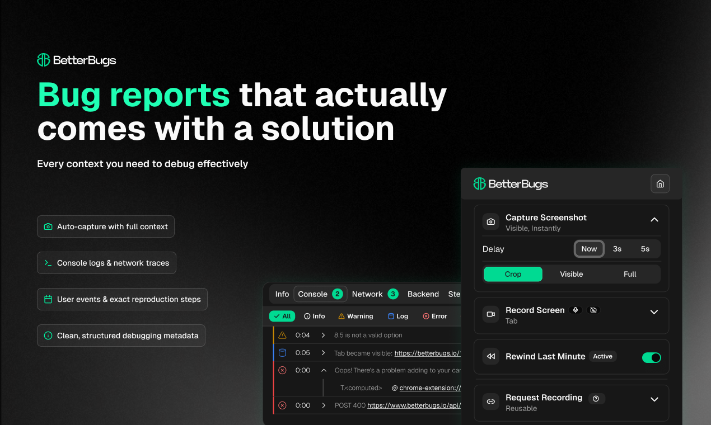

# BetterBugs Developer Utility Tools



<div align="left">

<p align="center">
    <a href="https://betterbugs.io?ref=github" target="_blank"><b>Website</b></a> •
    <a href="https://docs.betterbugs.io/" target="_blank"><b>Documentation</b></a> •
    <a href="https://discord.com/invite/HF8XjwVtPh" target="_blank"><b>Join our Community</b></a> • 
    <a href="https://twitter.com/BetterBugs" target="_blank"><b>Twitter</b></a> •
    <a href="https://www.linkedin.com/company/betterbugs/" target="_blank"><b>LinkedIn</b></a>
</p>

<div align="center">

<a href="https://discord.com/invite/HF8XjwVtPh"></a>
<a href="https://twitter.com/BetterBugs"></a>
<a href="https://www.linkedin.com/company/betterbugs/"></a>

</div>

<div align="center">
    
<a href="https://www.producthunt.com/products/betterbugs-io" target="_blank">

</a>

</div>

---

## About BetterBugs

[BetterBugs](https://betterbugs.io) is designed to simplify how bugs are captured, shared, and fixed by giving developers real execution context instead of assumptions. We focus on making debugging faster, clearer, and closer to reality by capturing what actually happened in the user environment and delivering it directly to developers and AI tools in realtime.

With BetterBugs, debugging stops being guesswork and becomes a shared, reliable source of truth.

**Key Features:**
- Real session context from production environments
- One-click bug capture with automatic context gathering
- Reproducible bug timelines with clear event sequences
- AI-ready debugging context for AI developer tools
- Live collaboration and shared bug analysis
- Seamless integrations with developer workflows

[Learn more about BetterBugs →](https://betterbugs.io)

---

## BetterBugs Development Tools

This repository contains our free, open-source development utilities—a comprehensive collection of 40+ tools designed to accelerate your development workflow. From text conversion and code formatting to data transformation and validation, our tools eliminate repetitive tasks and help you focus on what matters—building great software.

Built with modern technologies and designed for developers, by developers.

### Why Open Source Dev Tools?

We believe in providing developers with the best tools, regardless of their budget. These utilities are complementary to BetterBugs and help developers in their day-to-day work. By open sourcing them, we contribute to the developer community and welcome improvements from contributors worldwide.

### Why BetterBugs Development Tools?

Developers today work with fragmented tooling across multiple platforms:

- **Scattered Tools**: Text converters here, code formatters there, validators elsewhere. Context switching kills productivity.
- **Unreliable Conversions**: Online tools lack transparency about data handling and security.
- **Offline Limitations**: Most tools require internet connectivity or don't work reliably offline.
- **Performance Issues**: Heavy web tools slow down your workflow.
- **Integration Gaps**: Tools don't work well together, forcing manual data transfer between them.

This leads to lost time and frustration when you just need to convert a format or validate some data.

BetterBugs Development Tools solves this by providing:

- **40+ Tools in One Place**: Everything you need without switching between websites.
- **Instant Conversions**: No waiting, no network delays. Real-time results.
- **Offline Support**: Works perfectly without internet thanks to PWA technology.
- **Built for Speed**: Optimized performance with Next.js and modern architecture.
- **Privacy First**: Your data stays on your machine. No logging, no tracking.
- **Open Source**: See exactly how tools work. Contribute and improve them.

## Features

- **40+ Development Tools**: Text manipulation, code formatting, validation, generation, conversion, and more
- **Modern Stack**: Built with Next.js 14, React 18, TypeScript, and Tailwind CSS
- **Fast & Responsive**: Optimized performance with server-side rendering and instant feedback
- **PWA Support**: Progressive Web App capabilities for offline access
- **Monaco Editor**: Professional code editing with syntax highlighting
- **Dark Mode Ready**: Theme support built-in for comfortable viewing
- **Zero Data Collection**: Your data never leaves your machine
- **Completely Open Source**: MIT Licensed, fully auditable code

## Available Tools

### Text Tools
- Text case converters (uppercase, lowercase, title case, sentence case)
- Text counters (word, character, sentence, line)
- Text formatters and manipulators
- Lorem Ipsum generator

### Code Tools
- JavaScript minifier and obfuscator
- JSON formatter and minifier
- HTML to Markdown converter
- Markdown to HTML converter
- Code comparer
- CSS formatters and converters

### Data Tools
- JSON validator and formatter
- CSV converters and tools
- QR Code generator
- Credit card generator and validator
- Base64 encoder/decoder
- URL encoder/decoder

### Color Tools
- Color code converters (HEX, RGB, CMYK)
- Color picker and inverter
- Random color generator

### And Many More...

Browse all available tools at [BetterBugs Development Tools](https://www.betterbugs.io/development-tools).

## Getting Started

### Prerequisites

- Node.js >=20.8.0
- npm >=10.0.0

### Installation

1. **Clone the repository**
   ```bash
   git clone https://github.com/betterbugs/dev-tools.git
   cd dev-tools
   ```

2. **Install dependencies**
   ```bash
   npm install
   ```

3. **Run the development server**
   ```bash
   npm run dev
   ```

4. **Open your browser**
   Navigate to [http://localhost:3000](http://localhost:3000)

## Building for Production

```bash
npm run build
npm start
```

## Project Structure

```
dev-tools/
├── app/
│   ├── [slug]/                    # Dynamic routes for individual tools
│   ├── components/                 # React components
│   │   ├── developmentToolsComponent/  # Tool-specific components
│   │   ├── layout/                # Header, Footer, Layout
│   │   ├── ui/                    # Reusable UI components
│   │   └── theme/                 # Theme and icons
│   ├── contexts/                  # React contexts
│   ├── libs/                      # Utilities and constants
│   ├── styles/                    # Global styles and SCSS
│   └── page.tsx                   # Homepage
├── public/                        # Static assets
├── .github/
│   ├── workflows/                 # GitHub Actions
│   └── ISSUE_TEMPLATE/            # Issue templates
├── .releaserc.json                # Semantic Release config
├── CONTRIBUTING.md                # Contribution guidelines
├── SECURITY.md                    # Security policy
└── package.json                   # Dependencies and scripts
```

## Adding a New Tool

1. Create a component in `app/components/developmentToolsComponent/YourToolName.tsx`
2. Add configuration to `app/libs/developmentToolsConstant.tsx`
3. Add route to `app/libs/constants.tsx`
4. The tool automatically appears on the homepage

Example:
```typescript
"use client";
import React, { useState } from "react";

const MyNewTool = () => {
  const [input, setInput] = useState("");
  
  return (
    <div>
      <input 
        value={input} 
        onChange={(e) => setInput(e.target.value)} 
      />
      {/* Your tool logic */}
    </div>
  );
};

export default MyNewTool;
```

## Contributing

We welcome contributions! Please read our [Contributing Guide](CONTRIBUTING.md) to get started.

Key points:
- Follow [Conventional Commits](https://www.conventionalcommits.org)
- Target the `develop` branch for feature PRs
- See our [Pull Request Template](.github/PULL_REQUEST_TEMPLATE.md) for guidance
- Releases are automated via semantic versioning

## Code of Conduct

We're committed to providing a welcoming and inclusive environment. Please read and follow our [Code of Conduct](CODE_OF_CONDUCT.md).

## Security

Found a security vulnerability? Please email us at dev@betterbugs.io instead of using the issue tracker. See our [Security Policy](SECURITY.md) for details.

## Reporting Issues

Found a bug? Open an issue on [GitHub Issues](https://github.com/betterbugs/dev-tools/issues) with:
- Clear description of the problem
- Steps to reproduce
- Expected vs actual behavior
- Browser and OS information

See our [Bug Report Template](.github/ISSUE_TEMPLATE/bug_report.md).

## Feature Requests

Have ideas for new tools or features? [Submit a feature request](https://github.com/betterbugs/dev-tools/issues/new?template=feature_request.md).

## Contributors

We're grateful to all contributors making BetterBugs Development Tools better!

<a href="https://github.com/betterbugs/dev-tools/graphs/contributors">
  
</a>

## License

This project is licensed under the [MIT License](LICENSE) - see the LICENSE file for details. Free for personal and commercial use.

## Acknowledgments

Built with the following amazing technologies:

- [Next.js](https://nextjs.org/) - React framework
- [Ant Design](https://ant.design/) - UI components
- [Monaco Editor](https://microsoft.github.io/monaco-editor/) - Code editor
- [Tailwind CSS](https://tailwindcss.com/) - Styling
- [Phosphor Icons](https://phosphoricons.com/) - Icon library

---

Made with ❤️ by the [BetterBugs](https://betterbugs.io) team. [Open source](https://github.com/betterbugs/dev-tools) and always free.
